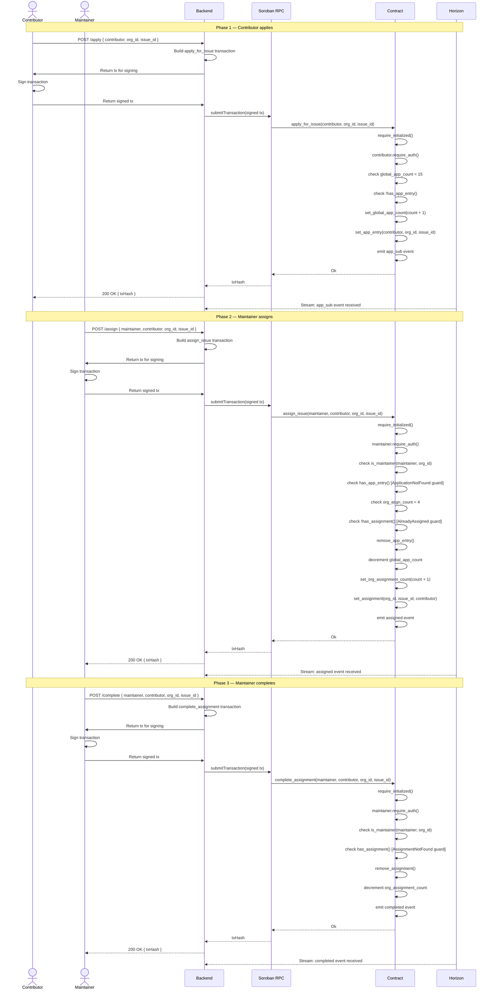
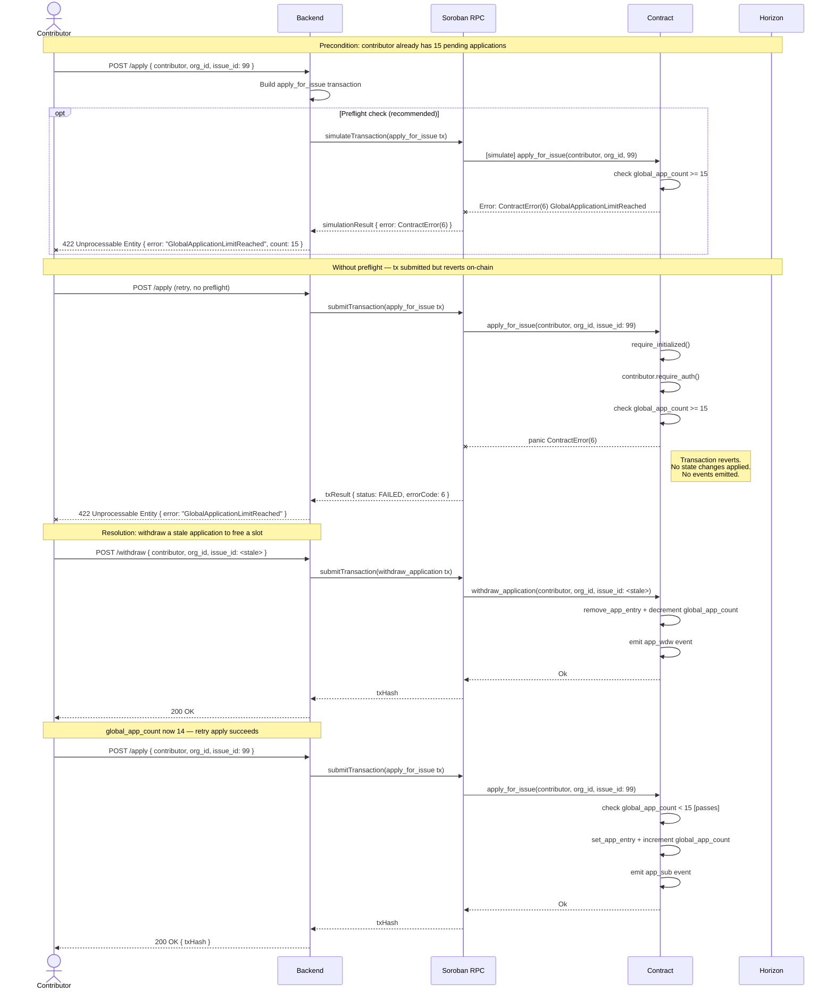
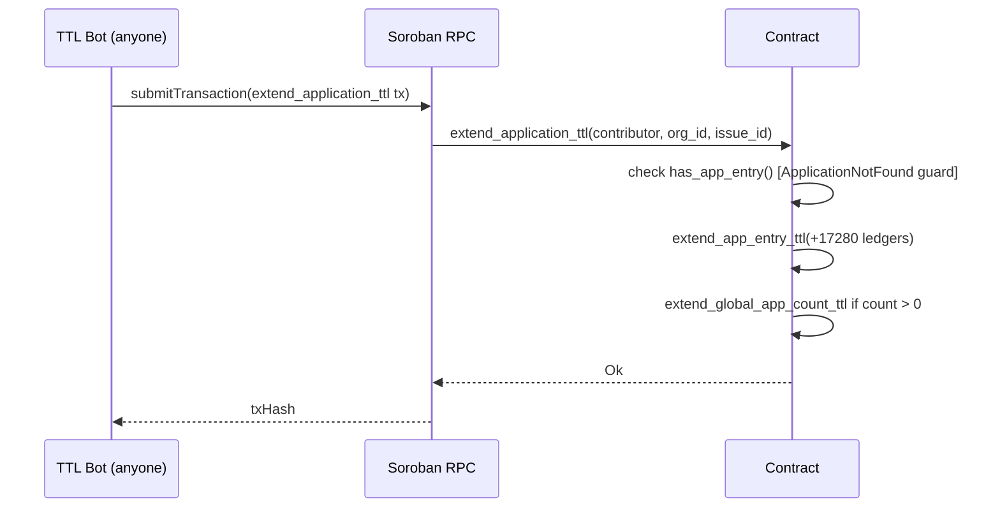

# Transaction Lifecycle

This document describes every significant transaction flow in WorkloadGovernor, illustrated with Mermaid sequence diagrams. Each diagram shows all actors: Contributor (or Maintainer), Backend, Soroban RPC, Contract, and Horizon.

## Table of Contents

- [Actors](#actors)
- [Diagram 1: Happy Path — Apply → Assign → Complete](#diagram-1-happy-path--apply--assign--complete)
- [Diagram 2: Withdrawal Path — Apply → Withdraw](#diagram-2-withdrawal-path--apply--withdraw)
- [Diagram 3: Revocation Path — Assign → Revoke](#diagram-3-revocation-path--assign--revoke)
- [Diagram 4: Error Path — Apply Fails (Cap Reached)](#diagram-4-error-path--apply-fails-cap-reached)
- [TTL Extension Flow](#ttl-extension-flow)
- [Notes on State Transitions](#notes-on-state-transitions)
- [See Also](#see-also)

---

## Actors

| Actor | Role |
|---|---|
| **Contributor** | End-user applying for or withdrawing from issues |
| **Maintainer** | Registered org maintainer performing assignment operations |
| **Backend** | Application server that constructs and submits transactions |
| **Soroban RPC** | Stellar network node accepting contract invocations |
| **Contract** | WorkloadGovernor smart contract on-chain |
| **Horizon** | Stellar Horizon API for event streaming and transaction status |

---

## Diagram 1: Happy Path — Apply → Assign → Complete

This diagram shows the full lifecycle from a contributor's initial application through maintainer assignment to final completion. This is the most common flow.



---

## Diagram 2: Withdrawal Path — Apply → Withdraw

This diagram shows a contributor cancelling their own pending application before it is assigned.

```mermaid
sequenceDiagram
    actor Contributor
    participant Backend
    participant SorobanRPC as Soroban RPC
    participant Contract
    participant Horizon

    Note over Contributor,Horizon: Phase 1 — Contributor applies (abbreviated)

    Contributor->>Backend: POST /apply { contributor, org_id, issue_id }
    Backend->>SorobanRPC: submitTransaction(apply_for_issue tx)
    SorobanRPC->>Contract: apply_for_issue(contributor, org_id, issue_id)
    Contract->>Contract: set_app_entry + increment global_app_count
    Contract->>Contract: emit app_sub event
    Contract-->>SorobanRPC: Ok
    SorobanRPC-->>Backend: txHash
    Backend-->>Contributor: 200 OK { txHash }

    Note over Contributor,Horizon: Phase 2 — Contributor withdraws

    Contributor->>Backend: POST /withdraw { contributor, org_id, issue_id }
    Backend->>Backend: Build withdraw_application transaction
    Backend->>Contributor: Return tx for signing
    Contributor->>Contributor: Sign transaction
    Contributor->>Backend: Return signed tx
    Backend->>SorobanRPC: submitTransaction(signed tx)
    SorobanRPC->>Contract: withdraw_application(contributor, org_id, issue_id)
    Contract->>Contract: require_initialized()
    Contract->>Contract: contributor.require_auth()
    Contract->>Contract: check has_app_entry() [ApplicationNotFound guard]
    Contract->>Contract: remove_app_entry(contributor, org_id, issue_id)
    Contract->>Contract: decrement global_app_count
    Contract->>Contract: emit app_wdw event
    Contract-->>SorobanRPC: Ok
    SorobanRPC-->>Backend: txHash
    Backend-->>Contributor: 200 OK { txHash }
    Horizon-->>Backend: Stream: app_wdw event received

    Note over Backend: global_app_count is now restored;<br/>contributor may apply elsewhere
```

---

## Diagram 3: Revocation Path — Assign → Revoke

This diagram shows a maintainer revoking an active assignment, for example when a contributor abandons work or a deadline is missed.

```mermaid
sequenceDiagram
    actor Maintainer
    participant Backend
    participant SorobanRPC as Soroban RPC
    participant Contract
    participant Horizon

    Note over Maintainer,Horizon: Precondition: issue already assigned (see Diagram 1, Phases 1–2)

    Maintainer->>Backend: POST /revoke { maintainer, contributor, org_id, issue_id }
    Backend->>Backend: Build revoke_assignment transaction
    Backend->>Maintainer: Return tx for signing
    Maintainer->>Maintainer: Sign transaction
    Maintainer->>Backend: Return signed tx
    Backend->>SorobanRPC: submitTransaction(signed tx)
    SorobanRPC->>Contract: revoke_assignment(maintainer, contributor, org_id, issue_id)
    Contract->>Contract: require_initialized()
    Contract->>Contract: maintainer.require_auth()
    Contract->>Contract: check is_maintainer(maintainer, org_id)
    Contract->>Contract: check has_assignment() [AssignmentNotFound guard]
    Contract->>Contract: remove_assignment(org_id, issue_id, contributor)
    Contract->>Contract: decrement org_assignment_count
    Contract->>Contract: emit revoked event
    Contract-->>SorobanRPC: Ok
    SorobanRPC-->>Backend: txHash
    Backend-->>Maintainer: 200 OK { txHash }
    Horizon-->>Backend: Stream: revoked event received

    Note over Maintainer,Horizon: org_assignment_count decremented;<br/>contributor may be re-assigned elsewhere.<br/>Application NOT restored — contributor must re-apply.
```

---

## Diagram 4: Error Path — Apply Fails (Cap Reached)

This diagram shows what happens when a contributor hits the global application cap (`GlobalApplicationLimitReached`, error 6). The same structural pattern applies to `OrgAssignmentLimitReached` (error 7) during `assign_issue`.



---

## TTL Extension Flow

Application entries in temporary storage expire after 17,280 ledgers (~24 h). The `extend_application_ttl` function is permissionless — anyone can call it to keep an application alive.



Call this before the application's ledger TTL expires. Monitor application ages in your backend by tracking the ledger height at which each application was submitted.

---

## Notes on State Transitions

### Application lifecycle

```
[not present]
     │  apply_for_issue
     ▼
[pending: app_entry + g_apps increment]
     │                    │
     │ assign_issue        │ withdraw_application
     ▼                    ▼
[assigned: asgn +        [not present:
 o_asgn increment]        app_entry removed,
     │                    g_apps decremented]
     │ complete_assignment
     │ revoke_assignment
     ▼
[not present: asgn removed, o_asgn decremented]
```

### Key invariants enforced by the contract

- `global_app_count >= 0` (enforced via `saturating_sub`)
- `org_assignment_count >= 0` (enforced via `saturating_sub`)
- `global_app_count <= 15` (enforced at `apply_for_issue`)
- `org_assignment_count <= 4` (enforced at `assign_issue`)
- An application entry and an assignment entry for the same `(contributor, org_id, issue_id)` cannot coexist — assignment consumes the application atomically

---

## See Also

- [maintainer-guide.md](maintainer-guide.md) — CLI commands for each maintainer operation
- [error-reference.md](error-reference.md) — Full resolution playbooks for all 11 errors
- [storage-design.md](storage-design.md) — Storage key schema and collision-free proof
- [ORG_MANAGEMENT_GUIDE.md](ORG_MANAGEMENT_GUIDE.md) — Admin operations and org setup
